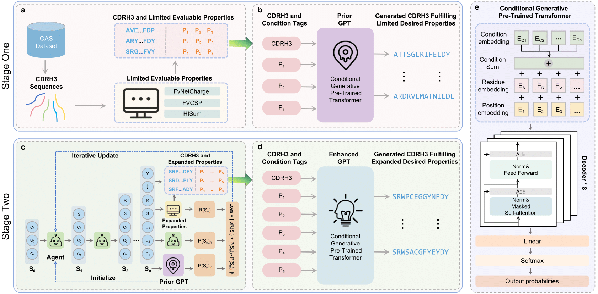

#  DualGPT-AB : A Dual-Stage Condition-Guided Generative Optimization Framework for Therapeutic Antibody Design 
## Overview of DualGPT-AB
This study introduces DualGPT-AB, a dual-stage Condition-Guided Generative Optimization Framework for therapeutic antibody design. We propose a Conditional Generative Pre-trained Transformer (Conditional GPT) framework that models sequence-property relationships through learnable property embeddings and reinforcement learning (RL)-driven optimization. The framework consists of two stages: Prior GPT Training and Enhanced GPT Training. The Prior GPT is trained on a dataset labeled with limited properties to learn fundamental sequence patterns. Subsequently, the Enhanced GPT is refined through an RL-based sequence accumulation process, enabling it to generate antibody sequences that fulfill  multiple desired properties. By leveraging this dual-stage strategy, DualGPT-AB efficiently explores the antibody sequence space while optimizing antigen specificity and key developability properties.

<div align="center">

</div>

## Clone the repository
Clone this repository using the following command:
```
git clone git@github.com:23AIBox/DualGPT-AB.git
cd ab-gen
```

## Set up environment
Setup the required environment using requirements.txt with python. While in the project directory run:
```
pip install -r requirement.txt
```

We also provided a conda environment file (from Linux), users can build the environment by running:
```
conda env create -f environment.yaml
```

## Install netMHCIIpan
- Download NetMHCIIpan 4.1 as shown in [the guide](https://services.healthtech.dtu.dk/services/NetMHCIIpan-4.0/).
- Modify NMHOME in /netMHCIIpan-4.1/netMHCIIpan file to be your unzipped folder, e.g.

```
setenv	NMHOME	/xxx/netMHCIIpan-4.1
```
Test if netMHCIIpan-4.1 works properly:
```
python -m agent.scoring.MHCAffinity
```

## Run Conditional GPT

DualGPT-AB allows the generation of antibody CDRH3 sequences using a trained Conditional GPT model, which includes two stages: Prior GPT and Enhanced GPT. The Prior GPT is trained on a dataset labeled with limited properties (FvNetCharge, FvCSP, and HISum), enabling it to generate sequences optimized for these fundamental developability properties. The Enhanced GPT leverages an expanded dataset obtained through reinforcement learning, encompassing additional critical properties such as HER2 specificity and MHC II minPR (immunogenicity), allowing the model to efficiently generate sequences that simultaneously fulfill multiple desired properties.

To generate CDRH3 sequences, run the following command:  

```
python run_GPT.py --num_to_sample 10000 --temperature 1.0 --seed 42 --max_len 14 --out_file <output_csv_path> --model_path <model_checkpoint>
```
- **`--max_len`**: Set to `14` for Prior GPT and `13` for Enhanced GPT, defining the maximum length of generated CDRH3 sequences.
- **`--out_file`**: Path to the csv file where the generated sequences will be saved. Replace **`<output_csv_path>`** with the desired file path.
- **`--model_path`**: Path to the Conditional GPT model checkpoint you want to use. Replace **`<model_checkpoint>`** with the actual model path.
We upload trained Conditional GPT model checkpoints in the `results/42` directory.

## Run RL  

DualGPT-AB employs a reinforcement learning (RL)-based sequence optimization strategy to iteratively generate and accumulate CDRH3 sequences with expanded properties. The RL model is initialized with the Prior GPT and serves as an agent that explores the sequence space by generating new sequences, evaluating them against multiple property constraints, and refining its policy accordingly. Through iterative sequence accumulation and evaluation, the RL process enables the construction of a high-quality dataset, which is later used to train the Enhanced GPT.

To run the reinforcement learning process for optimizing and accumulating CDRH3 sequences, use the following command:

```
python run_RL.py --prior <prior_gpt_checkpoint> --agent <prior_gpt_checkpoint> --output_dir <output_directory> --n_steps 2000 --batch_size 64 --sigma 60 --max_len 13 --seed 42 
```
- **`--prior`**: Path to the Prior GPT checkpoint used to initialize RL. Replace `<prior_gpt_checkpoint>` with the actual model path.
- **`--agent`**: Path to the Agent checkpoint, typically initialized from the Prior GPT. Replace `<prior_gpt_checkpoint>` with the same model path as `--prior`.
- **`--output_dir`**: Directory to store output files generated during RL training. Replace `<output_directory>` with the desired output folder.


## Dataset Information 
The datasets related to this study can be accessed at [Zenodo: https://doi.org/10.5281/zenodo.15037471](https://doi.org/10.5281/zenodo.15037471). These include:  
- The raw data used in the paper, 
- The dataset scored by limited property evaluators,  
- The processed datasets used to train the Prior GPT.  

You can download these files and place them in the `data/OAS` directory.


